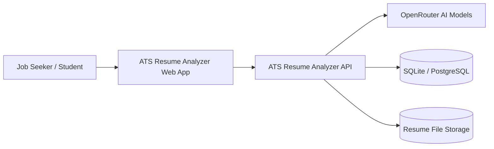
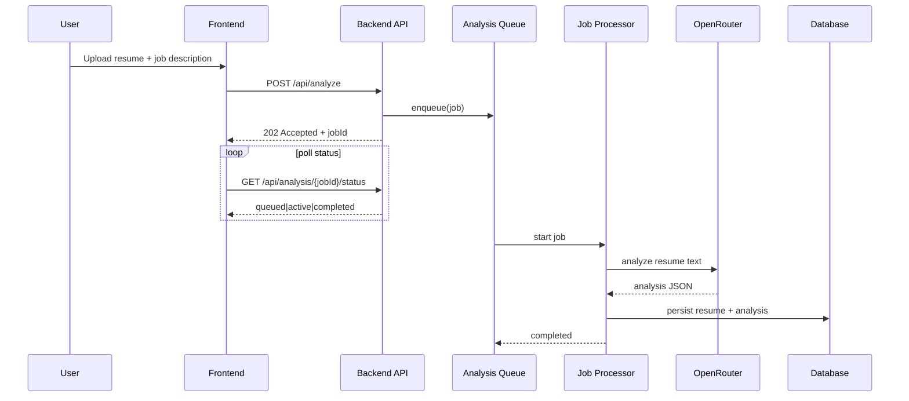
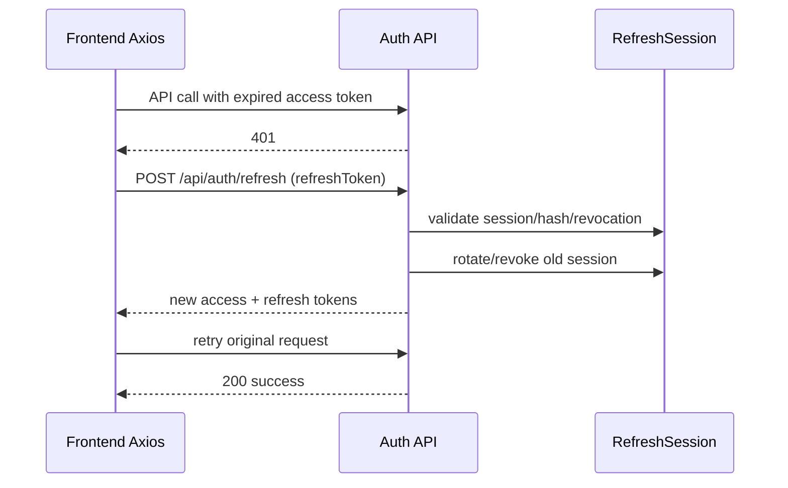
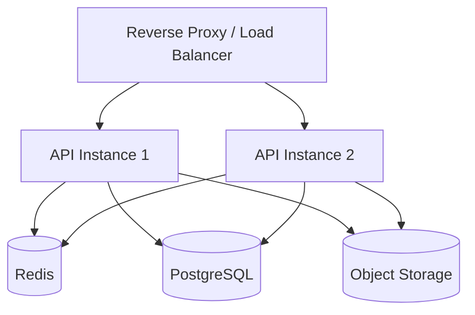

# System Architecture Document
## ATS Resume Analyzer

_Date: 2026-03-20_

## 1) Architecture goals

- Keep feature delivery fast for a 3-developer team.
- Separate concerns clearly across frontend, backend, and data layers.
- Support async AI analysis without blocking user interactions.
- Preserve a migration path from single-instance demo to production-style deployment.

---

## 2) C4 — Level 1 (System Context)



---

## 3) C4 — Level 2 (Container View)

```mermaid
flowchart TB
    subgraph Client
      FE[React + Vite SPA\n(Zustand, Axios)]
    end

    subgraph Server
      API[Express API\nRoutes + Middleware]
      Q[Analysis Queue/Worker\n(Bull-style async processing)]
      SVC[Service Layer\n(Auth, Resume, AI, File)]
    end

    subgraph Data
      DB[(Prisma + SQLite/PostgreSQL)]
      UP[(uploads/resumes)]
    end

    FE -->|HTTPS/JSON| API
    API --> SVC
    API --> Q
    SVC --> DB
    SVC --> UP
    Q --> SVC
    SVC -->|HTTP API| OR[OpenRouter]
```

---

## 4) C4 — Level 3 (Backend Component View)

```mermaid
flowchart LR
    R[Routes] --> M[Middleware\n(auth, error, rate-limit)]
    M --> SV[Services]
    SV --> PR[Prisma Client]
    SV --> FS[File Storage Service]
    SV --> AIS[AI Service]
    SV --> Q[Queue APIs]
    PR --> DB[(DB)]
    FS --> UP[(Uploads)]
    AIS --> OR[OpenRouter]
```

---

## 5) Key runtime sequences

### 5.1 Analyze uploaded resume (async)



### 5.2 Access token refresh



---

## 6) Deployment architecture

## Current (project/demo)
- Single machine/container friendly.
- Frontend can be served via backend static build.
- Local file storage for resume uploads.
- SQLite default.

## Target (production-like)



---

## 7) Trust boundaries

1. **Browser ↔ API boundary**
   - Untrusted input enters here.
   - Must enforce auth, validation, sanitization.

2. **API ↔ AI provider boundary**
   - External model responses are untrusted.
   - Must parse/validate response schema before persistence.

3. **API ↔ File system boundary**
   - Uploaded files must be content-validated and user-scoped.

4. **Config/secrets boundary**
   - Secrets must never be embedded in source/image layers.

---

## 8) Cross-cutting quality concerns

### Security
- JWT + refresh-session model implemented.
- Input/file sanitization present.
- Immediate priority: remove hardcoded secrets from Docker artifacts.

### Reliability
- Async queue processing for heavy workloads.
- Graceful shutdown hooks present.
- Immediate priority: remove destructive DB reset startup commands.

### Performance
- Pagination and filtering patterns in backend.
- API retries/refresh handling in frontend.
- Immediate priority: optimize auth DB checks and use distributed limiter for scale.

### Observability
- Logging present.
- Future: metrics, tracing, and alerting layers.

---

## 9) Architecture decisions (recommended ADRs)

1. **ADR-001:** Async queue for AI analysis.
2. **ADR-002:** Refresh-session rotation strategy.
3. **ADR-003:** SQLite (dev) + PostgreSQL (scale path).
4. **ADR-004:** Distributed limiter and cache strategy (Redis).
5. **ADR-005:** Secret management policy for containerized runs.

---

## 10) Ownership map for 3 developers

- **Backend owner:** auth/session, analysis pipeline, DB interactions.
- **Frontend owner:** dashboard flows, resilience, accessibility, UX.
- **Platform owner:** Docker/CI, secrets policy, deployment/test automation.

This split minimizes merge conflicts and aligns with existing code module boundaries.
